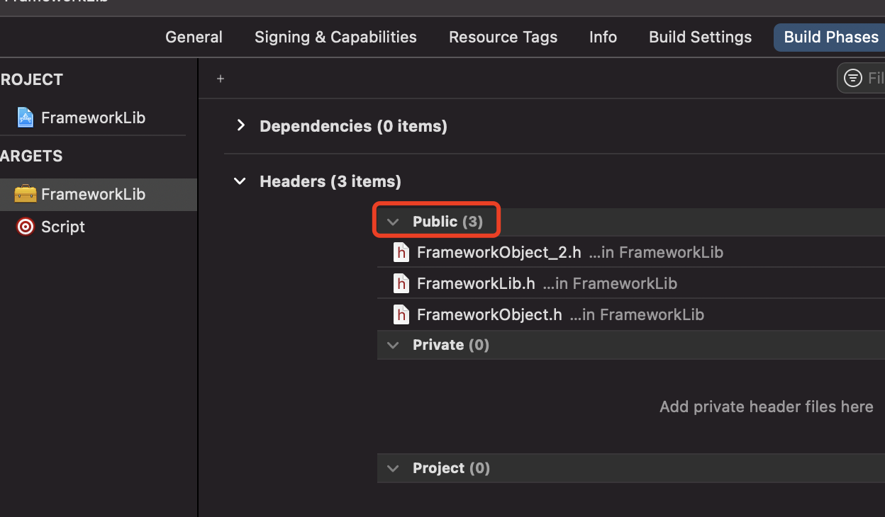

# 打包步骤及脚本
按图索骥 稳操胜券

# 一、Static Library 打包


##### 1 >> 选择 Static Library


##### 2 >> 选择 创建文件，完善功能，在此处暴露接口（.h）


##### 3 >> build settings 中设置支持最低的iOS操作系统版本


##### 4 >> build settings 中设置为静态库（一般默认就是此选项）


##### 5 >> build settings 中设置模拟器为：不支持arm64 (最新的模拟器是迟滞arm64架构的，为了后面合并真机和模拟器两个 `.a` 文件，所以设置此处选项)


##### 6 >> 增加target Aggregate（此处命名为Script）


##### 7 >> 为target (Script) 添加 Run Script


##### 8 >> 打包脚本填入Run Script中
```
---

#
if [ "${ACTION}" = "build" ]
then

#要build的target名
target_Name=${PROJECT_NAME}

#build之后的文件夹路径
build_DIR=${SRCROOT}/build

#真机build生成的framework文件路径
DEVICE_DIR_Framework=${build_DIR}/Release-iphoneos/${PROJECT_NAME}.framework

#模拟器build生成的framework文件路径
SIMULATOR_DIR_Framework=${build_DIR}/Release-iphonesimulator/${PROJECT_NAME}.framework

#目标文件夹路径
INSTALL_DIR=${SRCROOT}/Products/${PROJECT_NAME}

#判断build文件夹是否存在，存在则删除
if [ -d "${build_DIR}" ]
then
rm -rf "${build_DIR}"
fi

#判断目标文件夹是否存在，存在则删除该文件夹
if [ -d "${INSTALL_DIR}" ]
then
rm -rf "${INSTALL_DIR}"
fi

#创建目标文件夹
mkdir -p "${INSTALL_DIR}"

#build之前clean一下
xcodebuild -target ${target_Name} clean

#真机build
xcodebuild -target ${target_Name} -configuration Release -sdk iphoneos

#模拟器build
xcodebuild -target ${target_Name} -configuration Release -sdk iphonesimulator

#复制头文件到目标文件夹
cp -R "${DEVICE_DIR_Framework}" "${INSTALL_DIR}"

#合成模拟器和真机包
lipo -create "${DEVICE_DIR_Framework}/${PROJECT_NAME}" "${SIMULATOR_DIR_Framework}/${PROJECT_NAME}" -output "${INSTALL_DIR}/${PROJECT_NAME}.framework/${PROJECT_NAME}"

#打开目标文件夹
open "${INSTALL_DIR}"

fi


---
```


# 二、Framework 打包
Framework的打包过程类似，需要注意的地方是：
##### 1 >> 选择如下选项创建framework

 
##### 2 >> build settings 中设置为静态库（默认是Dynamic Library）


##### 3 >> 在默认生成的头文件中暴露自定义的文件


##### 4 >> 在Build Phrase 中public 中暴露头文件


##### 5 >> 打包脚本填入Run Script中
```
---

#
if [ "${ACTION}" = "build" ]
then

#要build的target名
target_Name=${PROJECT_NAME}

#build之后的文件夹路径
build_DIR=${SRCROOT}/build

#真机build生成的framework文件路径
DEVICE_DIR_Framework=${build_DIR}/Release-iphoneos/${PROJECT_NAME}.framework

#模拟器build生成的framework文件路径
SIMULATOR_DIR_Framework=${build_DIR}/Release-iphonesimulator/${PROJECT_NAME}.framework

#目标文件夹路径
INSTALL_DIR=${SRCROOT}/Products/${PROJECT_NAME}

#判断build文件夹是否存在，存在则删除
if [ -d "${build_DIR}" ]
then
rm -rf "${build_DIR}"
fi

#判断目标文件夹是否存在，存在则删除该文件夹
if [ -d "${INSTALL_DIR}" ]
then
rm -rf "${INSTALL_DIR}"
fi

#创建目标文件夹
mkdir -p "${INSTALL_DIR}"

#build之前clean一下
xcodebuild -target ${target_Name} clean

#真机build
xcodebuild -target ${target_Name} -configuration Release -sdk iphoneos

#模拟器build
xcodebuild -target ${target_Name} -configuration Release -sdk iphonesimulator

#复制头文件到目标文件夹
cp -R "${DEVICE_DIR_Framework}" "${INSTALL_DIR}"

#合成模拟器和真机包
lipo -create "${DEVICE_DIR_Framework}/${PROJECT_NAME}" "${SIMULATOR_DIR_Framework}/${PROJECT_NAME}" -output "${INSTALL_DIR}/${PROJECT_NAME}.framework/${PROJECT_NAME}"

#打开目标文件夹
open "${INSTALL_DIR}"

fi


---
```


